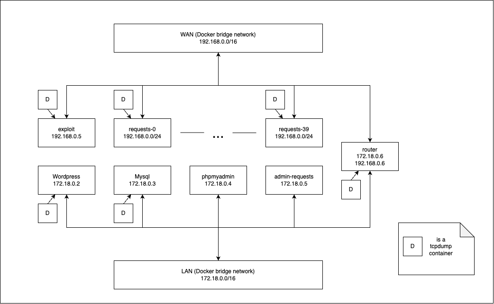

Setup a bit annoying

Once you have started the scenario DB may fail to connect.

Go into capture/wordpress/wp-config.php and update database creds and retry.

If that fails try removing all containers except wordpress, mysql, and phpmyadmin.

Steps:
- Start scenario
- Check wp-config.php database creds are correct
- Change theme to twenty-twenty
- Install WP-Discuz 7.0.4
- Change site-url in WPDashboard settings, find url.sql for commands to run in phpmyadmin db

